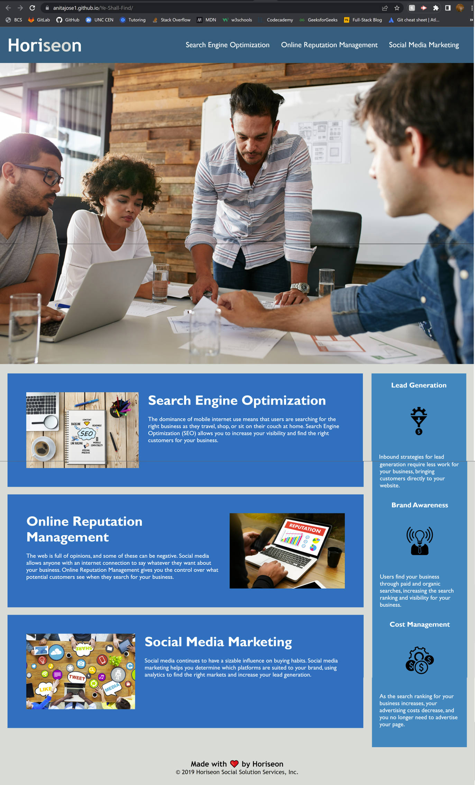

# Ye Shall Find

## Description

Having an accessible webpage means more traffic to the page as the page will be better positioned in Google and other search engines. This, in turn, can help the business to get more clients and grow.

Horiseon, a marketing agency, wanted their website to be refactored so that its codebase follows accessibility standards and is more SEO-friendly. 

This was a good opportunity for me to learn more about web accessibility and put the newly-acquired learnings into practice. 

While refactoring, I did the following:
* Added sematic HTML elements
* Fixed the broken Search Engine Optimization navigation link
* Added appropriate "alt" tags wherever necessary
* Provided a logical structure for the HTML elements 
* Added comments to the CSS file
* Added a title for the page

## Location and Screenshot

The deployed website can be viewed at: https://anitajose1.github.io/Ye-Shall-Find/

```md

```

## Credits

The following links served as useful references as I tried to understand Semantic HTML:

* https://www.w3schools.com/html/html5_semantic_elements.asp

* https://developer.mozilla.org/en-US/docs/Glossary/Semantics

